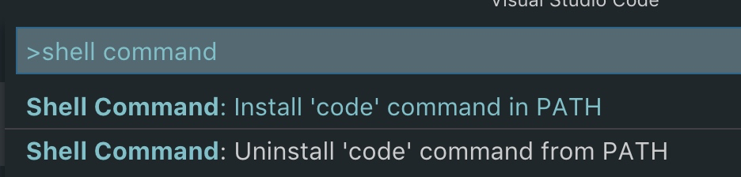
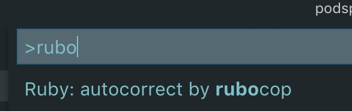
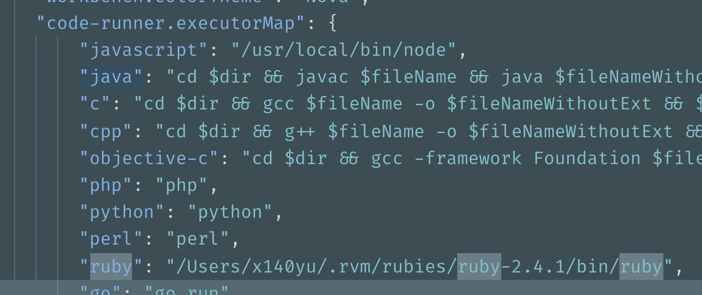

# 0x01 环境搭建


## 使用 RVM 安装 Ruby

OS X 自带的 Ruby 环境很不友好，版本老旧，安装的目录不正确，导致安装 gem 还需要使用 `sudo` 权限。所以~~强迫~~推荐每个人都把 Ruby 用正确的方式重新安装一把

### 安装 RVM

RVM 全称 Ruby Version Manager，顾名思义它可以管理 Ruby 版本，安装它的方式很简单，

```bash
\curl -sSL https://get.rvm.io | bash -s stable
```

### 安装 Ruby

为了让 RVM 生效，需要切换到新的 shell 窗口。然后开始安装 Ruby。


```bash
# 这个版本不作强制要求，理论上 2.4+ 的都没有问题
rvm install 2.4.1
 
# 把刚才安装的版本设置为默认版本
rvm --default use 2.4.1
 
# 查看当前 Ruby 版本，should output 2.4.1
ruby -v
```

## 安装配置 VSCode

### 安装

VSCode 是非常现代且优秀的 editor，使用简单，扩展丰富，~~强迫~~希望你也安装

 [点击这里下载](https://code.visualstudio.com/Download)

### 配置

#### 安装 code 命令

VSCode 自带一条 `code` 的命令，在 terminal 里输入 `code .` 即可使用 VSCode 打开当前目录，很方便。

安装的方式不复杂，

点击 View - Command Palette ，输入 `shell command`，选中 `install code command in PATH` 



#### 安装 ruby-rubocop 插件

[点我安装](https://marketplace.visualstudio.com/items?itemName=misogi.ruby-rubocop)

它是一个 Ruby 的 lint 工具，背后集成了 rubocop，能在每次保存文件的时候自动 lint 整个文件。对于有 lint 错误的部分会有波浪线的提示，强迫症患者必备



它还提供了自动修正错误的功能，可以不费吹灰之力对文件产生的基本 lint 错误作出自动修正，简直是懒人的福音，所以还在等什么，赶紧安装吧（

#### 安装 code runner 插件

[点我安装](https://marketplace.visualstudio.com/items?itemName=formulahendry.code-runner)

作用是使用 cmd + r 可以直接运行当前 ruby 文件，不需要 editor 和 terminal 两头跑

安装完成后，需要在配置中把 `code-runner.executorMap.ruby` 改成 `which ruby` 的路径




#### 安装 YARD Documenter 插件

[点我安装](https://marketplace.visualstudio.com/items?itemName=pavlitsky.yard)


写文档专用，输入 Document with YARD 命令即可为 Ruby 中的类，方法进行注释