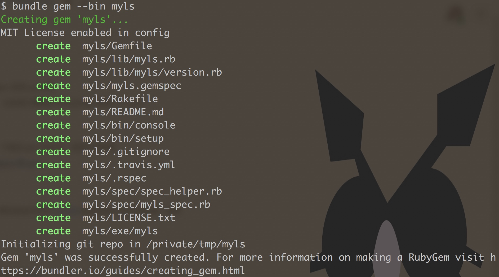
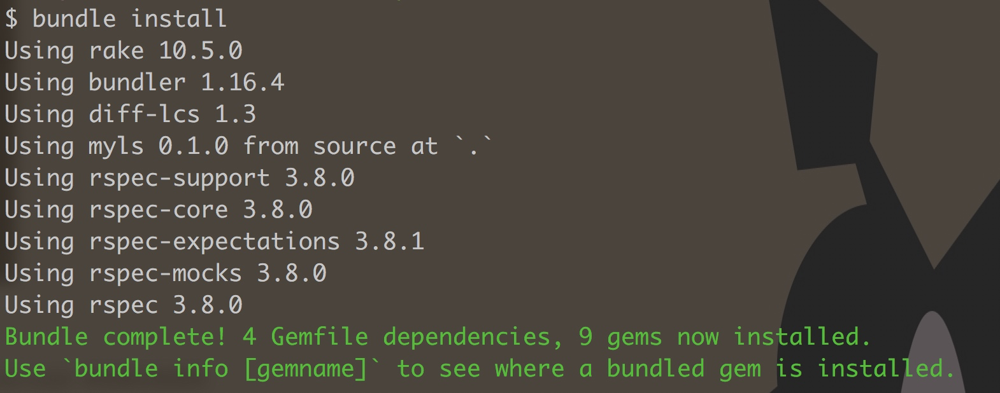
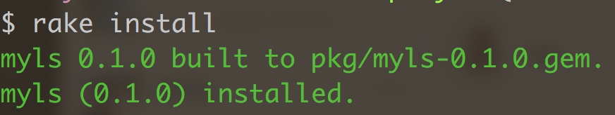
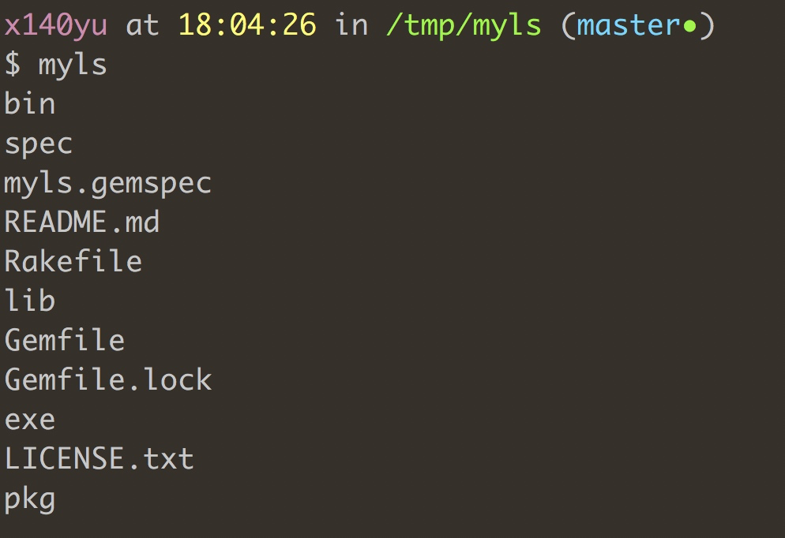

# 0x02 编写第一个 Ruby gem


## 名词解释

### 什么是 [gem](https://rubygems.org/)

每种语言都有自己的包管理工具，比如 JavaScript 使用 yarn/npm，Python 使用 pip 等等

Ruby 的包管理工具是 gem。一个 gem 相当于一个包含 ruby 代码的包，比如我们熟知的 CocoaPods 就是一个 gem

#### [gemspec](https://guides.rubygems.org/specification-reference/)

写过 podspec 就一定知道什么是 gemspec，它就是一坨 Ruby 代码，用于描述 gem 的名字，依赖关系等等

通过查看 [CocoaPods](https://github.com/CocoaPods/CocoaPods/blob/master/cocoapods.gemspec) 的 gemspec 我们可以知道，它依赖 claide，xcodeproj 等 gem

### 什么是 [bundler](https://bundler.io/)

bundler 是用来管理项目 gem 依赖的。通过它提供的[一系列命令](https://bundler.io/docs.html)， 可以很轻松地对包含 [Gemfile](https://bundler.io/gemfile.html) 的项目进行 gem 的安装，更新

或者通过 `bundle gem $NAME` 创建一个新的 gem

### 编写第一个 gem

下面我们通过一个简单的栗子，来实践一下如何通过 Ruby gem 创建一个简单的 [CLI](https://en.wikipedia.org/wiki/Command-line_interface)

这个命令实现的功能类似于 *nix 中的 `ls`，打印出当前目录的所有文件

#### 创建 gem

把这个命令起名为 myls，通过执行 `bundle gem --bin myls` 创建出整个 gem 的结构，`–bin` 参数会让 bundler 自动创建一个与 gem name 同名的命令




#### 安装依赖

bundler 生成的项目默认会带有几个 development 依赖，可以通过 `bundle install` 来安装这些依赖

但在这之前，需要将 myls.gemspec 中的 TODO 都删掉，homepage 改为正确的 URL 比如 [https://zhihu.com](https://zhihu.com/)  不然会出现下面的错误


下面是修改完成后执行 `bundle install` 的输出，




#### 编写代码

需要关注的文件有，

* `exe/myls` 此文件作为 `myls` 命令的入口，在命令行执行 `myls` 时，此文件会被执行
* `lib/myls.rb` 真正实现 `myls` 命令的地方

在 `lib/myls.rb` 中编写如下的代码，就是简单地使用 `Dir.glob` 方法输出当前文件夹下的所有文件

```ruby
require "myls/version"
 
module Myls
  def self.ls
    puts Dir.glob '*'
  end
end
```

然后跳到 `exe/myls` 文件中，调用该方法，

```ruby
#!/usr/bin/env ruby
 
# 这里 require 的是 `lib/myls(.rb)`
require "myls"
 
Myls.ls
```

至此，我们简单版本的 `ls` 已经完成了

怎么样，是不是很简单

#### 安装

在编写完成后，通过 `rake install` 安装编写好的 gem 到本地的电脑中



然后继续输入命令 `myls` 就可以看到我们刚刚编写好的代码产生的效果啦，😍




#### 卸载

gem uninstall myks
