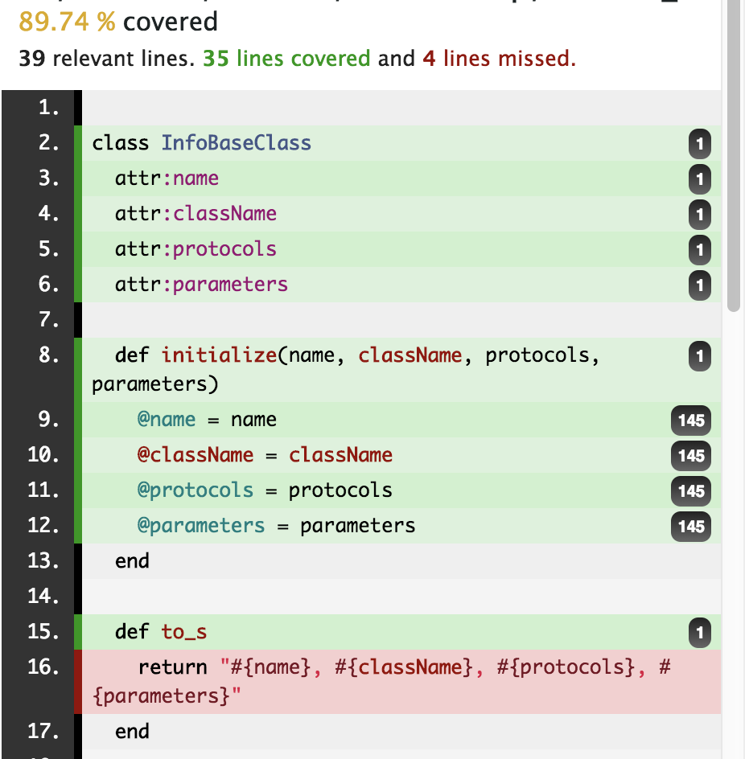

# 附录一 - 为一个 gem 添加 GitLab Runner + coverage + rubocop 的支持

> 很遗憾目前 bundler 不支持从模版创建 gem 的功能，不过默认创建的代码结构已经足够好了。不过缺少 coverage 的支持。

## 创建一个 gem

> 如果已经创建好了一个 gem，可以直接跳过这一步

```sh
bundle gem $GEM_NAME
```

创建完成后不要忘记把 `$GEM_NAME.gemspec` 中的 TODO 都删掉，`homepage` 改为正确的 URL

## 添加 coverage 支持

> 这里使用 [simplecov](https://rubygems.org/gems/simplecov) 作为 coverage 的支持

### 配置工程

在 `$GEM_NAME.gemspec` 添加 simplecov 相关的依赖，

```ruby
spec.add_development_dependency 'simplecov'
spec.add_development_dependency 'simplecov-html'
```

然后运行 `bundle install` 安装这些依赖

在项目的根目录创建 `.simplecov` 文件，并输入以下内容，

```ruby
SimpleCov.start do
  # 需要被加入 coverage 计算的文件
  track_files 'lib/**/*.rb'
  # 需要被过滤掉的文件
  add_filter '/spec/'
end
```

在 `spec/spec_helper.rb` 最上边添加以下内容，作用是每次 `rake test` 的时候让 `simplecov` 介入，计算 coverage，

```ruby
require 'simplecov'

# 添加 HTML 的 formatter
SimpleCov.formatter = SimpleCov::Formatter::HTMLFormatter
SimpleCov.start
```

### 覆盖率汇报

每次执行 `rake` 跑测试的时候，就会在 log 的最后看到当前的覆盖率了，

```
Coverage report generated for RSpec to /path/to/gem. 808 / 2435 LOC (33.18%) covered.
```

HTML 版本的覆盖率报告会在 `coverage/index.html` 出现，会显示每行代码的运行次数和覆盖情况，




## 添加 RuboCop 相关配置

由于在 0x01 中我们已经在 VSCode 中安装了 [RuboCop](https://github.com/rubocop-hq/rubocop) 插件，现在就不需要再集成一次了。如果使用其它 Editor/IDE 开发可以参考它的 README 进行集成

在没有 RuboCop 配置文件的情况下，使用的是它的默认配置，还是比较严格的。如果你能做到通过它默认配置的所有规则，我是不推荐你使用配置的。如果是团队开发，或者有些个人的开发习惯，需要使用配置文件，添加或减少规则也是很方便的

在工程的根目录创建 `.rubocop.yml`，根据文档 enable 或 disable 对应的规则就 ok 了

> 在[这里](https://rubocop.readthedocs.io/en/latest/)可以看到全部的规则

## GitLab Runner

参考下面的文件编写 `.gitab-ci.yml` ，

```yaml
stages:
  - test

test:
  stage: test
  coverage: '/(\d+(?:\.\d*)?\%)/'
  script:
  - bundle install
  - bundle exec rake
  tags:
    - Team-iOS-Platform
```

