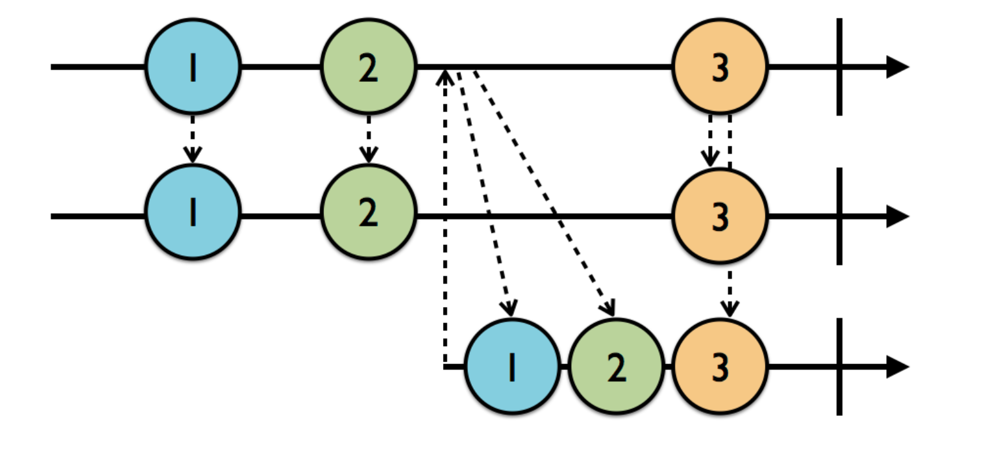

# RxSwift

## Basic

The logo of [ReactiveX](http://reactivex.io/) is a electric eel（电鳗）.

Core issues with writing asynchronous code,

- the order in which pieces of work are performed
- shared mutable data.

Side effect, any change to the state outside of the current scope.

## Observables

`Observable<T>` provides the ability to asynchronously produce a sequence of events that can “carry” an immutable snapshot of data T. It allows classes to subscribe for values emitted by another class over time.

An `Observable` is just a sequence.

There are many ways to create a `Observable`, `just`, `of`, `create`, etc.

### `ObservableType` protocol

An observable can emmit three types of events,

- `next`
- `completed`
- `error`

When an `Obsservable` emmits `completed` or `error` event, it can no longer emit events, that means, it's life is done.

## Subjects

Subjects act as both an `observable` and as an `observer`. The subject received `.next` events, and each time it received an event, it turned around and emitted it to its subscriber.

### PublishSubject

The `PublishSubject` only emits to current subscribers. But when a `PublishSubject` send a stop event(`.completed` or `.error`), the subscribe after that stop can also receive the event.


### BehaviorSubject

`BehaviorSubjects` work similarly to `PublishSubjects`, except they will replay the latest `.next` event to new subscribers.

You have to specify the default value when create the `BehaviorSubject`.


### ReplaySubject

It will then replay a buffer to new subscribers.

You have to specify the buffer size when create the `ReplaySubject`.



### Variable

A `Variable` wraps a `BehaviorSubject` and stores its current value as state. But it's value can not generate `.error`.

## Operators

Like transformation operators for array(`map`, `filter`, `reduce`), you can apply these simlar concept to Observables. They don't cause side effects.

Check out the [RxMarbles](http://rxmarbles.com/), it shows lots of operators.

### Fliter

#### Ignore

- `ignoreElements`, it'll ignore all the `.next` events, only let the `.completed` & `.error` events go
- `elementAt(2)`, only pass the third event
- `filter { predicate closure }`, it'll only pass the events which pass the predicate closure, just like the `filter` in the Swift Standard Libray

#### Skip

- `skip(2)`, skip the first 2 elements
- `skipWhile { predicate closure }`, it'll skip elements until one element has pass the predicate closure, if one element has passed it, the `skipWhile` will not work anymore
- `A.skipUntil(B)`, A & B are both `Observable`s, A's elements will be skipped until B emmits a element

#### Take

- `take(2)`, only take the first 2 elements
- `takeWhile { predicate closure }`, like `skipWhile` but opposite, it'll only take the elements pass the predicate closure, but once a element won't pass the condition, the operator won't work, it won't take any elements
- `A.takeUntil(B)`, it'll take A's elements until B emmits a element, it's often used like this, `someObservable.takeUntil(self.rx.deallocated)`

#### Distinct

- `distinctUntilChanged`, it prevents sequential duplicates, `(A-A-A-B-B-A-B).distinctUntilChanged` -> `A-B-A-B`

### Transform

#### Transform elements

- `toArray`, transform individual elements in to an array
- `map`, just like the Swift `map`, but for `Observable`s

#### Transform inner Observables

- `flatMap`, Projects each element of an observable sequence to an observable sequence and merges the resulting observable sequences into one observable sequence. `Observable` inside `Observable`, we flatten that into one sequence.


- `flatMapLatest`, like `flatMap`, but when a new `Observable` of `Observables` comes, the previouse `Observable` of `Observables` are ignored, it'll switch to the latest one


### Combine

- `startWith`, prefix an `Observable` with the given initial value
- `concat`, `A.concat(B)` it waits A to complete, then subscribe to B
- `merge`, a merged `Observable` subscribes to each of the sequence, when it's inner `Observable`s emmits events, it notify the outter observers. [`merge` in RxMarbles](http://rxmarbles.com/#merge)
- `combineLatest`, [`combineLatest` in RxMarbles](http://rxmarbles.com/#combineLatest)
- `zip`, it waitied for each to emit a new value, just like a zipper [`zip`](http://rxmarbles.com/#zip)
- `withLatestFrom`, `A.withLatestFrom(B)` when A emits a event, it will take the B's latest value
- `sample`
- `amb`, `A.amb(B)` who comes last, who get unsubscribed
- `switchLatest`, images are better than words


- `reduce`, like normal `reduce` in Swift, but for `Observable`s, but it'll only be called when the `Observable` completed

```swift
let source = Observable.of(1, 3, 5, 7, 9)
let observable = source.reduce(0, accumulator: +)
observable.subscribe(onNext: { value in
  print(value)
}) // 25
```

- `scan`

```swift
let source = Observable.of(1, 3, 5, 7, 9)
let observable = source.scan(0, accumulator: +)
observable.subscribe(onNext: { value in
  print(value)
}) // 1 4 9 16 25
```

## Schedulers

Just like dispatch queues.


## Credits

- The RxSwift Book